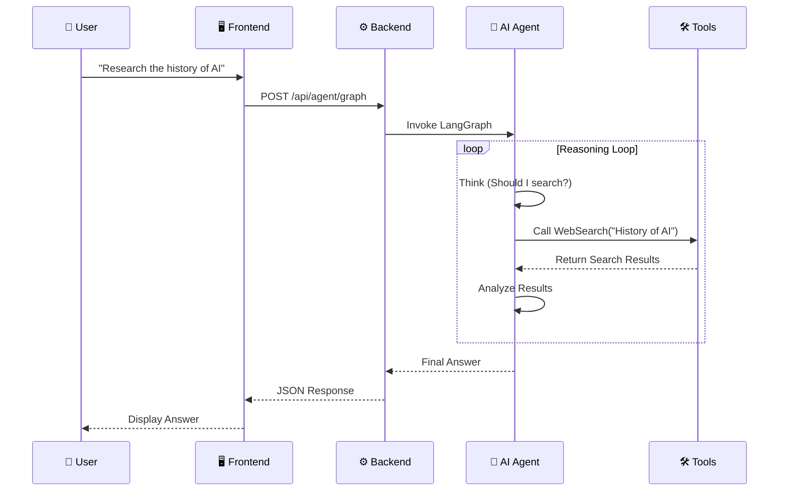

# 🎓 NexusAI: Advanced AI Engineering Masterclass

Welcome to **NexusAI**! 🚀

This project is a comprehensive **"Hands-On" Masterclass** in AI Engineering. It is designed to take you from a beginner to an advanced AI Engineer by building a production-grade system.

It covers everything from **FastAPI** backends to **Advanced Multi-Agent Orchestration** using LangGraph.

---

## 📑 Table of Contents
1.  [System Architecture](#-system-architecture)
2.  [Project Structure](#-project-structure)
3.  [Deep Dive: The Components](#-deep-dive-the-components)
    *   [1. The Backend (FastAPI)](#1-the-backend-fastapi)
    *   [2. The Database (SQLModel)](#2-the-database-sqlmodel)
    *   [3. LLM Fundamentals & Streaming](#3-llm-fundamentals--streaming)
    *   [4. RAG (Retrieval Augmented Generation)](#4-rag-retrieval-augmented-generation)
    *   [5. AI Agents & Tools](#5-ai-agents--tools)
    *   [6. Multi-Agent Orchestration (LangGraph)](#6-multi-agent-orchestration-langgraph)
4.  [Data Flow Diagram](#-data-flow-diagram)
5.  [How to Run](#-how-to-run)
6.  [Experiments to Try](#-experiments-to-try)

---

## 🏗️ System Architecture

This diagram shows the high-level design of NexusAI.

```mermaid
graph TD
    %% Nodes
    User([👤 User])
    Frontend[🖥️ Frontend (HTML/JS)]
    Backend[⚙️ Backend (FastAPI)]
    
    subgraph "🧠 AI Core"
        Router{🔀 Router}
        Chat[💬 Basic Chat]
        RAG[📚 RAG Engine]
        Agent[🕵️ Multi-Agent System]
    end
    
    subgraph "💾 Data Layer"
        SQL[(🗄️ SQLite DB)]
        Vector[(💠 ChromaDB)]
    end
    
    subgraph "🛠️ External Tools"
        OpenAI[☁️ OpenAI API]
        Tavily[🌐 Web Search]
    end

    %% Connections
    User <--> Frontend
    Frontend <-->|REST API / SSE| Backend
    Backend <--> Router
    
    Router -->|Simple Query| Chat
    Router -->|Document Q&A| RAG
    Router -->|Complex Task| Agent
    
    Chat <--> OpenAI
    
    RAG <-->|Embeddings| OpenAI
    RAG <-->|Retrieve| Vector
    
    Agent <-->|Plan/Reason| OpenAI
    Agent <-->|Search| Tavily
    Agent <-->|Calc/Tools| Backend
    
    Backend <-->|History| SQL
```

---

## 📂 Project Structure

Understanding the folder structure is key to navigating the codebase.

```text
nexus_ai/
├── app/
│   ├── api/                # 🌐 API Layer
│   │   ├── endpoints/      # Individual route handlers (chat, rag, agent)
│   │   └── api.py          # Main router aggregator
│   ├── core/               # ⚙️ Core Configuration
│   │   └── config.py       # Settings (API Keys, DB URL)
│   ├── db/                 # 💾 Database Layer
│   │   └── session.py      # DB Connection & Session management
│   ├── models/             # 📦 Data Models
│   │   ├── chat.py         # Database Tables (Conversation, Message)
│   │   └── structured.py   # Pydantic Models for LLM Output
│   ├── services/           # 🧠 Business Logic
│   │   ├── llm_service.py  # OpenAI wrapper & Streaming logic
│   │   └── rag_service.py  # Document ingestion & Retrieval logic
│   └── agents/             # 🕵️ Agentic Logic
│       ├── tools.py        # Tools (Calculator, Search, RAG)
│       ├── simple_agent.py # Single Agent (LangGraph React)
│       └── graph.py        # Multi-Agent Supervisor Graph
├── data/                   # 📁 Local Storage (SQLite & ChromaDB)
├── static/                 # 🎨 Frontend Assets (index.html)
├── main.py                 # 🚀 Application Entry Point
└── requirements.txt        # 📦 Dependencies
```

---

## 🔍 Deep Dive: The Components

### 1. The Backend (FastAPI)
*   **File**: `main.py`
*   **Concept**: We use **FastAPI** because it is the standard for AI applications. It supports **Asynchronous** operations (`async def`), which is crucial when waiting for slow LLM responses.
*   **Key Feature**: `lifespan` context manager handles database creation on startup automatically.

### 2. The Database (SQLModel)
*   **File**: `app/models/chat.py`
*   **Concept**: We use **SQLModel** (built on SQLAlchemy + Pydantic).
*   **Why**: It allows us to define database tables (`Conversation`, `Message`) using standard Python classes.
*   **Usage**: We store every chat message to give the AI "Memory" of past conversations.

### 3. LLM Fundamentals & Streaming
*   **File**: `app/services/llm_service.py`
*   **Concept**:
    *   **Streaming**: Instead of waiting 5 seconds for the full answer, we send it character-by-character using `yield`. This makes the app feel instant.
    *   **Structured Outputs**: We use `llm.with_structured_output(PydanticModel)` to force the AI to return JSON. This is critical for building reliable software that parses AI responses.

### 4. RAG (Retrieval Augmented Generation)
*   **File**: `app/services/rag_service.py`
*   **Concept**: Giving the AI a "Textbook".
*   **The Pipeline**:
    1.  **Ingestion**: We load a PDF or Text file.
    2.  **Chunking**: We split the text into 1000-character chunks using `RecursiveCharacterTextSplitter`. *Why?* Because LLMs have a context limit, and we only want to send relevant parts.
    3.  **Embedding**: We use `OpenAIEmbeddings` to turn text into a list of numbers (Vectors).
    4.  **Storage**: We save these vectors in **ChromaDB** (a local vector database).
    5.  **Retrieval**: When you ask a question, we mathematically find the "nearest" vectors (most similar text) and send them to the LLM.

### 5. AI Agents & Tools
*   **File**: `app/agents/tools.py`
*   **Concept**: LLMs are just text predictors. They can't do math or search the web. We give them "Tools".
*   **Tools Implemented**:
    *   `calculator`: Solves math problems safely.
    *   `web_search`: Uses **Tavily API** to get real-time information from the internet.
    *   `knowledge_base`: A tool that wraps our RAG service, allowing the agent to "read" your documents.

### 6. Multi-Agent Orchestration (LangGraph)
*   **File**: `app/agents/graph.py`
*   **Concept**: For complex tasks, one agent isn't enough. We use **LangGraph** to build a "Company" of agents.
*   **Architecture**: **Supervisor-Worker Pattern**.
    *   **Supervisor (Router)**: An LLM that acts as a manager. It looks at your request and decides: "Does this need the Researcher? Or the Tutor?"
    *   **Researcher**: A specialized agent that uses the Web Search tool.
    *   **Tutor**: A specialized agent that explains concepts.
*   **Flow**: User -> Supervisor -> Researcher -> Supervisor -> Tutor -> User.

---

## 🔄 Data Flow Diagram

How does a request travel through the system?



---

## 🚀 How to Run

1.  **Install Dependencies**:
    ```bash
    pip install -r requirements.txt
    ```
2.  **Setup Environment**:
    *   Open `.env`.
    *   Add `OPENAI_API_KEY=sk-...`
    *   (Optional) Add `TAVILY_API_KEY=tvly-...` for real search.
3.  **Run Server**:
    ```bash
    python main.py
    ```
4.  **Open Application**:
    *   Frontend: [http://localhost:8000/static/index.html](http://localhost:8000/static/index.html)
    *   API Docs: [http://localhost:8000/docs](http://localhost:8000/docs)

---

## 🧪 Experiments to Try

1.  **The "Hallucination" Test**:
    *   Ask the **Basic Chat**: "What is the latest feature of LangChain released yesterday?" (It will likely hallucinate or say it doesn't know).
    *   Ask the **Agent**: "Search for the latest LangChain features released yesterday." (It will use the tool and give the correct answer).

2.  **The "Memory" Test**:
    *   Tell the agent: "My name is Abdul."
    *   Ask later: "What is my name?" (It should remember).

3.  **The "RAG" Test**:
    *   Upload a private document (e.g., a resume or a specific article).
    *   Ask a question that *only* exists in that document.

---

## 🎓 Teacher's Note
This project is built to be **extended**. Here are some challenges for you:
1.  **Add a new Tool**: Can you add a tool that fetches stock prices?
2.  **Add a new Agent**: Can you add a "Coder" agent to the graph?
3.  **Improve Memory**: Can you store the chat history in the SQLite database instead of just in memory?

Happy Coding! 🚀
